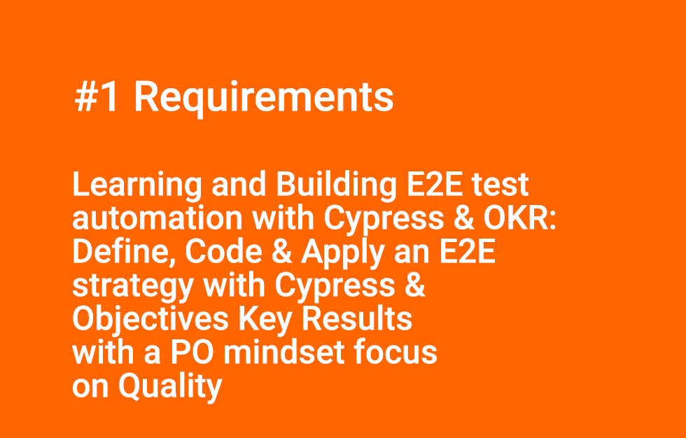
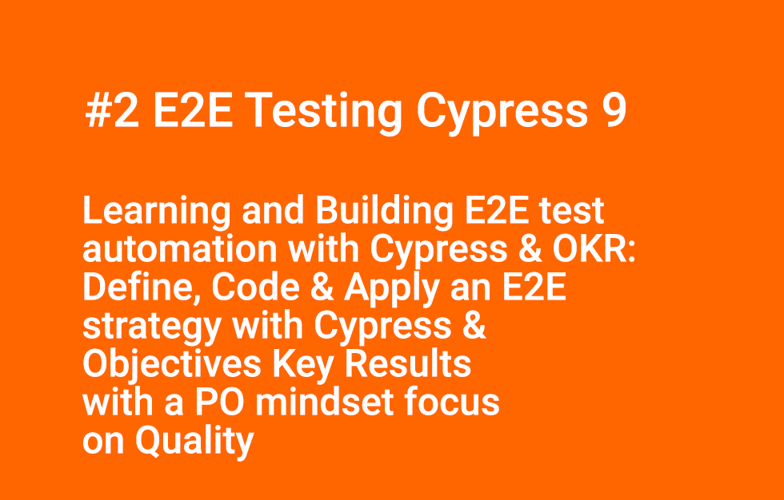
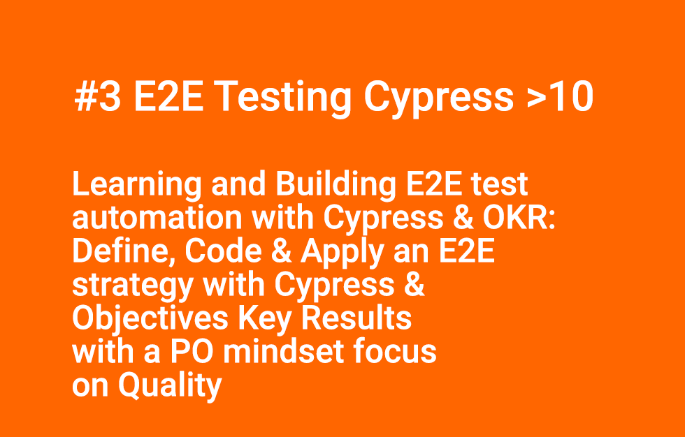

# video-guidelines-book-learning-and-building-e2e-test-automation-with-cypress-and-okr

**Here is the guidelines that I have using in the YouTube videos to present the code from this GitHub repository.**


#### INTRO
Learning and Building E2E test automation with Cypress & OKR: Define, Code & Apply an E2E strategy with Cypress & Objectives Key Results with a PO mindset focus on Quality

The book's purpose is very pragmatic, this is not a programming book as I don't dwell on coding or programming explanations! Even though you will see, and hope learn some code. 

I strongly advise you to get also proper information on the official documentation on Cypress website to deepen your knowledge or search on stackoverflow.com or GitHub.com

#### OBJECTIVE

**My intent for this book was to define from A to Z an applied strategy to quality management with proven concepts from a P.O point of view. So, we will go from OKRs strategy applied to Q/A to a concrete implementation with the help of Cypress.**

#### NOTE
In the table of content, you can see that there are 27 HANDS UPs. This gimmick act like an "Andon" in the Lean methodology. If you are facing a problem, then fix it do not wait.


#### RESOURCES
- My personal BLOG
https://flaven.fr/publications/

- The book on AMAZON
https://www.amazon.com/dp/B0BP216HCW/

- The code on GITHUB
https://github.com/bflaven/book-learning-and-building-e2e-test-automation-with-cypress-and-okr


### 1. VIDEOS

**All the videos of this Book are available on YouTube in this playlist: [https://www.youtube.com/playlist?list=PL999tA6UKRx_h2fT3LeUGK2xF7zVDHPw8](https://www.youtube.com/playlist?list=PL999tA6UKRx_h2fT3LeUGK2xF7zVDHPw8)**

- [Video #1 Requirements - Learning and Building E2E test automation with Cypress & OKR: Define, Code & Apply an E2E strategy with Cypress & Objectives Key Results with a PO mindset focus on Quality](https://www.youtube.com/watch?v=KBEeiyw54zM)
[](https://www.youtube.com/watch?v=KBEeiyw54zM)


- [Video #2 E2E Testing Cypress 9 - Learning and Building E2E test automation with Cypress & OKR: Define, Code & Apply an E2E strategy with Cypress & Objectives Key Results with a PO mindset focus on Quality](https://www.youtube.com/watch?v=7tRTcIA9zS8)
[](https://www.youtube.com/watch?v=7tRTcIA9zS8)

- [Video #3 E2E Testing Cypress 10 or more - Learning and Building E2E test automation with Cypress & OKR: Define, Code & Apply an E2E strategy with Cypress & Objectives Key Results with a PO mindset focus on Quality](https://www.youtube.com/watch?v=SjYEMgqbJkE)
[](https://www.youtube.com/watch?v=SjYEMgqbJkE)


### 2. GIT

```bash
cd /Users/brunoflaven/Desktop/_e2e_testing_cypress_attempt/

# get the remote directory if needed
git clone https://github.com/bflaven/book-learning-and-building-e2e-test-automation-with-cypress-and-okr.git
```

### 3. COMMANDS

```bash
# path
cd /Users/brunoflaven/Desktop/_e2e_testing_cypress_attempt/working_dir


# local WP
# http://cypress.mydomain.priv/wordpress/
# http://cypress.mydomain.priv/wordpress/wp-admin/
# admin:admin
```

### 4. FOR CYPRESS@9.7.0 (001_e2e_testing_cypress_v9)

```bash
cd /Users/brunoflaven/Desktop/_e2e_testing_cypress_attempt/working_dir
# Create your testing directory
mkdir e2e_testing_cypress_v9

# Go to the testing directory
cd e2e_testing_cypress_v9
# with the path complete
--- cd /Users/brunoflaven/Desktop/_e2e_testing_cypress_attempt/e2e_testing_cypress_v10/

# Install the last version
npm install cypress --save-dev
# Install a specific version
npm install --save-dev cypress@9.7.0

# Install generate the package.json
# generated a package.json and node_modules directory
npm init 

# Fill the package.json
# description: Cypress 10. This attempt made for E2E-CYPRESS-WP, runnings cypress tests on WP for a testing for PO. Better generated a package.json and node_modules directory
# keywords: Cypress 10, cypress, attempt, PO, E2E-CYPRESS-WP, e2e-cypress-wp
# author: bflaven
# git: https://github.com/bflaven/


# Open for the first time
npx cypress open

# install the require plugin when erase the package.json
# npm install
```


### 5. OTHER COMMAND

```bash

# OPEN THE RUNNER
npx cypress open --config video=false,screenshotOnRunFailure=false

# OPEN THE RUNNER
npx cypress open --env LANG="en_EN" --config video=false,screenshotOnRunFailure=false

# RUN THROUGH THE CONSOLE
npx cypress run --config video=false,screenshotOnRunFailure=false

# RUN THROUGH THE CONSOLE WITH A SPECIFIC BROSWER
npx cypress run --browser chrome --config video=false,screenshotOnRunFailure=false

# RUN A SPECIFIC TEST
npx cypress run --config video=false,screenshotOnRunFailure=false --spec "cypress/integration/e2e-wp/020_wp_mutiple_login_role.spec.js"


npx cypress run --env LANG="en_EN" --config video=false,screenshotOnRunFailure=false --spec "cypress/integration/e2e-wp/020_wp_mutiple_login_role.spec.js"

# LAUNCH WITH A CUSTOM CONFIG
npx cypress open --env LANG="en_EN" --config-file "en_EN.conf.env.json" --config video=false,screenshotOnRunFailure=false


# cypress 10 for english with en_EN.conf.env.config.js

npx cypress open --env LANG="en_EN" --config-file "en_EN.conf.env.config.js" --config video=false,screenshotOnRunFailure=false

# # cypress 10 for sapnish with es_ES.conf.env.config.js
npx cypress open --env LANG="es_ES" --config-file "es_ES.conf.env.config.js" --config video=false,screenshotOnRunFailure=false


```

### 6. FOR CYPRESS ~10 LAST VERSION (002_e2e_testing_cypress_v10)

```bash
# Go to the main directory
cd /Users/brunoflaven/Desktop/_e2e_testing_cypress_attempt

# Create your testing directory
mkdir e2e_testing_cypress_v12

# Go to the testing directory
cd e2e_testing_cypress_v12

# with the path complete
cd /Users/brunoflaven/Desktop/_e2e_testing_cypress_attempt/e2e_testing_cypress_v10/

# Install generate the package.json
# generated a package.json and node_modules directory
npm init 

# Fill the package.json
# description: Cypress 10. This attempt made for E2E-CYPRESS-WP, runnings cypress tests on WP for a testing for PO. Better generated a package.json and node_modules directory
# keywords: Cypress 10, cypress, attempt, PO, E2E-CYPRESS-WP, e2e-cypress-wp
# author: bflaven
# git: https://github.com/bflaven/

# Install the last version
npm install cypress --save-dev

# Open for the first time
npx cypress open
```


